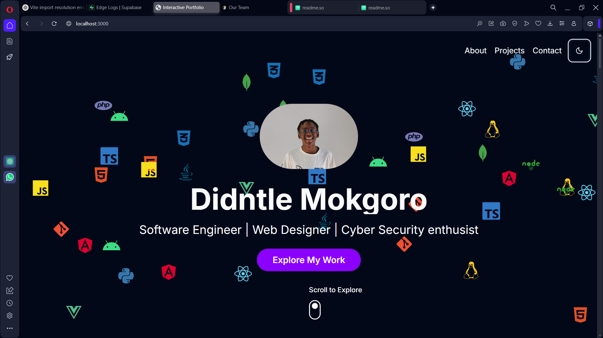

# 🚀 Didintle Portfolio Website  

A personal portfolio showcasing my web development and software engineering projects. This website highlights my skills, achievements, and ongoing projects while offering a glimpse into my journey as a developer.  

## 📌 Table of Contents  

- [📥 Installation](#installation)  
- [🚀 Usage](#usage)  
- [📦 Dependencies](#dependencies)  
- [✨ Features](#features)  
- [🤝 Contributing](#contributing)  
- [📜 License](#license)  

---

## 📥 Installation  

To get started with this project, follow these steps:  

1. **Clone the repository**:  
   ```bash
   git clone https://github.com/RtCzee/Didintle-Portfolio-website.git
   cd Didintle-Portfolio-website
   ```

2. **Install dependencies**:
   Make sure you have [Node.js](https://nodejs.org/) installed. Then, run the following command to install all necessary packages:
   ```bash
   npm install
   ```

   This will install the following dependencies:
   - `react`
   - `react-dom`
   - `react-icons`
   - `lucide-react`
   - `next-themes`
   - `react-hook-form`
   - `@hookform/resolvers`
   - `zod`
   - `tailwindcss`
   - `postcss`
   - `autoprefixer`
   - `date-fns` (ensure it's version `^2.28.0` or compatible)
   - Any other dependencies your project may require.

3. **Initialize Tailwind CSS** (if applicable):
   If your project uses Tailwind CSS, run the following command to set it up:
   ```bash
   npx tailwindcss init -p
   ```

4. **Add Media Files**:

   - 📷 Place your images in the `public` directory for easy access. For example, `public/DidintleMokgoro.jpg`.
   - 🎬Place your video files in the `public/videos` directory. For example, `public/videos/project1-demo.mp4`.

5. **Start the development server**:
   After the installation is complete, you can start the development server with:
   ```bash
   npm run dev
   ```

## 🚀Usage

Provide instructions on how to use your project. Include examples and screenshots if applicable. For example, you can view the projects section, which includes ongoing projects and their details.

## 📦Dependencies

Here’s a list of the main dependencies used in this project:

- ⚛️**React**: A JavaScript library for building user interfaces.
- 💅**React Icons**: A library for using popular icons in your React applications.
- 🎭**Lucide React**: A collection of beautiful open-source icons.
- 🌙**Next Themes**: A theme management library for Next.js applications.
- 🎯**React Hook Form**: A library for managing forms in React.
- 🛠**Zod**: A TypeScript-first schema declaration and validation library.
- **@hookform/resolvers**: A library for integrating validation libraries with React Hook Form.
- **Tailwind CSS**: A utility-first CSS framework for styling.
- 📆**Date-fns**: A modern JavaScript date utility library.

## ✨Features

- ✔ **Project Showcase** – Displays all my past and current projects with descriptions, images, and videos.  
- ✔ **Ongoing Projects** – Some projects have an “in-progress” status with preview restrictions.  
- ✔ **Responsive Design** – Works seamlessly across devices.  
- ✔ **Dark/Light Mode** – Toggle between themes for better viewing.  
- ✔ **Contact Section** – Visitors can reach out via an interactive form. 
## 🤝Contributing

If you would like to contribute to this project, please fork the repository and submit a pull request. Make sure to follow the code style and include tests for any new features.

## 📜License

This project is licensed under the MIT License - see the [LICENSE](LICENSE) file for details.

## 📸 Screenshot



## Note 
removed eluceat website preview because file was too large